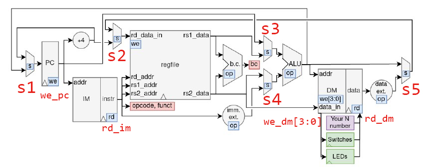

# Control Unit

Finite State Machine: Mealy machine

## Input 

* From instruction decode:

    * `funct7` = `inst[31:25]`

    * `funct3` = `inst[14:12]`

    * `opcode` = `inst[6:0]`

* From branch control:

    * `bc` = `0` or `1`

    When bc = 0, PC = PC + sign_ext(imm);

    When bc = 1, PC = PC + 4

## Output

* `op` = `{funct7, funct3, opcode}`

    Output to branch control, ALU, immediate extension and data extension units.

* Mux controls (s1~s5)

    Decides which data to take for different components.

    s1 to s5 as annotated on the image.

    e.g. add x3, x1, x2: (assume s = 0 -> mux takes upper, s = 1 -> mux takes lower)

    1. PC jumps from somewhere

    2. ALU takes rs1_data and rs2_data as input -> s3 = 1, s4 = 0

    3. ALU output to rd_data_in, s5 = 0, s2 = 0

    4. No branching, PC = PC+4, s1 = 0

* read enables

    When effective, memories take value from mem[addr] and send to output.

* write enables

    pc: when effective, take input and update pc reg.

    dm: when effective, write to corresponding byte(s) at mem[addr].

    reg: when effective, write rd_data_in to reg[rd_addr].

## Diagram Design

control unit design.drawio

